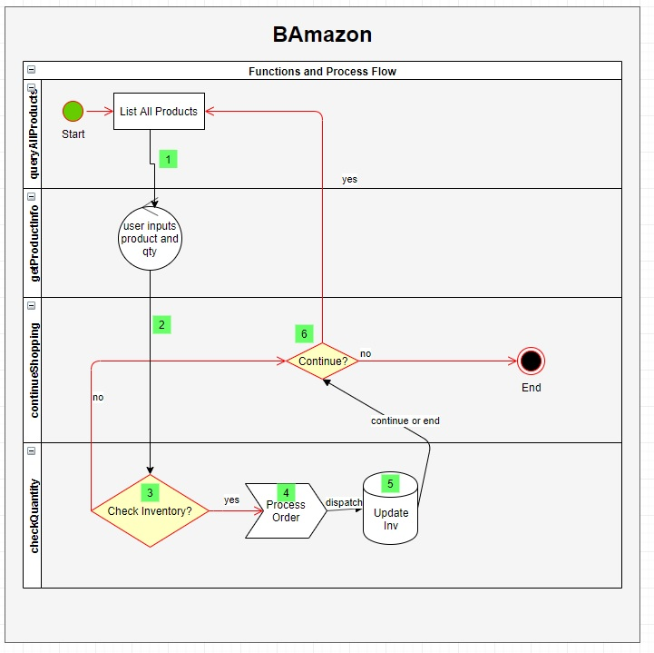

## BAmazon - The "B" is for "Better than Amazon!". - The **What**
- [GitHub repo](https://github.com/gfellouris/bamazon.git)

BAmazon is  an Amazon-like storefront that will take in orders from customers and deplete stock from the store's inventory. 

## Motivation - The **Why**
This project was created to help simulate the purchase and inventory of products using a command-line-interface (CLI).  It teaches the foundations for coding in node as well as working with a SQL datbase.

## Technologies used and why
<b>Built with</b>
- mySQL (npm) - used in order to store and update inventory that would be dynamic and maintained even when the app is not running.
- Inquirer (npm) - used to receive user input.
- Node.js - used to process user input.
- Screencastify - to record the CLI activity
- cloudconvert - to convert screencastify to a gif

## Features
Immediate inventory updates and blazing fast database updates.

## Screenshots
Include logo/demo screenshot etc.

### Screencastify (video)
- [Screencastify](https://drive.google.com/file/d/1P-CFgQU1EEvm2cyYnHKURgdGEvTmwYaW/view?usp=sharing)

### GIF (Video)
- [GIF](bamazonCLI.gif)

## Code Example
### Process Flow

### The main functions are:
* queryAllProducts - selects all the products from the database and lists it in a table
* getProductInfo - using inquirer to ask the user which product and the qty they want to purchase
* checkquantity - check that 1) inventory exists 2) we have enough in inventory, if yes, then it processes the order
* continueShopping - Is used multiple times to see if the user wants to continue shopping or exit.

## How to use?
### install npm packages:
npm i mysql
npm i inquirer

### Run the program by type:
node bamazonCustomer.js

## Credits
Shout-out to @Hetal for showing us the console.table function which gives the CLI a much nicer look with less code!
Thanks to @Vanessa for telling me about cloudconvert to convert my screencastify to a gif!

MIT © [George Fellouris]()
